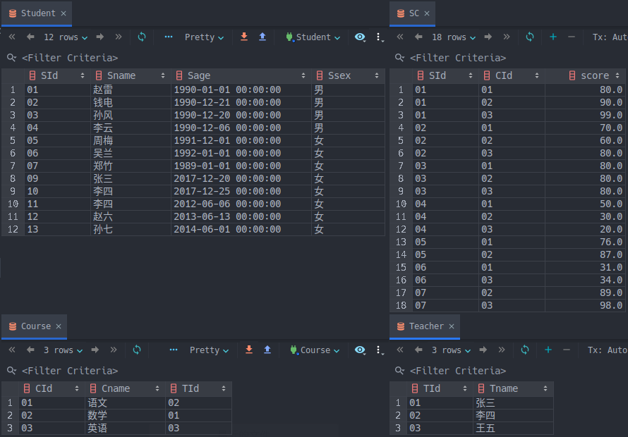

# sql50
50道经典的SQL练习题，练手和复习都很不错

#### 关于

这个项目主要来源是之前在网上流传的50道SQL练习题，大小问加起来50道左右，在不断流传的过程中也会有差异，我看到的最早来源是[超经典SQL练习题](https://blog.csdn.net/flycat296/article/details/63681089)

#### 使用项目

原版用的是```Sql Server```，在这里我重写了一些语句，改成了我用的```MySQL 8.0```版本，同时加了一些我自己的编程习惯

1. 使用根目录下的```create_db.sql```创建完整的数据库，一共4张表，36行专门设计的数据



1. sql源码位于```src/```文件夹，1号到18号问题难度递增，19题过后难度循环了，所以我在```src/```又分了两个文件夹```question1to18/```和```question19to45/```，每题都拥有一个独立的sql文件，每题的每种解法都单独写了一个文件，并添加了对应的注释
2. ```src/```下还有两个单独的文件：

- ```questions.txt```：所有问题的描述，可用于自检
- ```answers.sql```：```question1to18/```和```question19to45/```中所有题解的汇总，方便阅读

3. ```doc/```中存放了一些资源和博文
#### 博客

> 施工中...

#### 纠错和优化

这个项目对于初学者来说，可以很好地练习SQL语句，但这50道题不是绝对的《葵花宝典》，全部看完并不能让你单挑一个应用的所有SQL

主要问题有：

- 没有SELECT以外的练习，知识点狭窄
- 部分代码欠优化
- 未针对不同的DBMS细节作出说明
- 知识点文档还不完善

因此，在这里希望看到这个repo的朋友，作者水平有限，代码还有很多欠优化的地方甚至是错误，如果你有好的想法可以issue或者pr，我们一起让这个项目继续完善起来，成为一个SQL的进阶题库。如果你有好的原创题目或者例子，疑惑是，也可以直接pr，文件的具体格式参照我在```src/```中编写的sql语句：

- 用注释标注问题
- 采用较为易读的sql语句
- 附上语句结果

#### 版权

原资料来自网络，如有版权纠纷请联系作者
